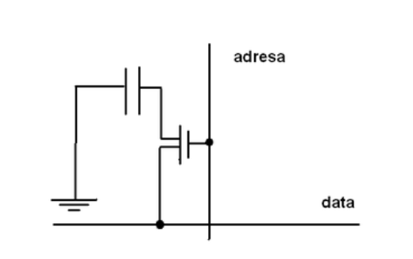
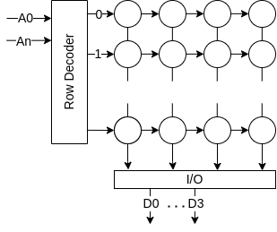
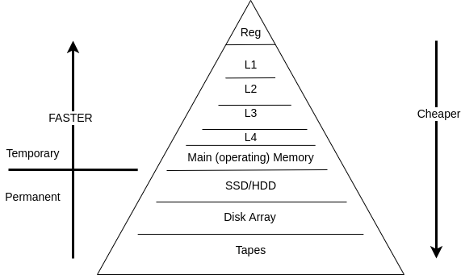

### Dle jakých kritérií či vlastností se dělí paměti počítačů?
- Typu přístupu
    - RAM (Random access memory) - libovolný přístup
    - SAM (Serial acess memory) - Seriový přístup
    - Speciální (paměť typu zásobník, fronta..)
- Možnosti zápisu/čtení
    - RWM (Read write memory) - pro zápis a čtení
    - ROM (Read only memory) - pouze pro čtení
    - Kombinované
        - NVRAM (Non volatile RAM)
        - WOM (Write only memory)
        - WORM (Write once - ready many times memory) - optické disky
- Principu elementární buňky
    - SRAM - statické paměti
    - DRAM - dynamické paměti
    - PROM, EPROM, EEPROM, FLASH - programovatelné paměti
- Uchování informace po odpojení napájení
    - Non-Volatile - Zachovají si informaci i po odpojení napájení
    - Volatile - Ztráci informaci po odpojení napájení (DRAM a SRAM)

### Jak je v dynamických pamětech ukládána informace a jak je udržována?
- Ve formě náboje v kondenzátoru
- Zapomenou svá data cca po 10ms
- Proto je nutné obnovovat napětí kondenzárorů - Refresh 

### Jaká je vnitřní organizace dynamických pamětí?
- Ve čtvercové matici v jedné, nebo více vrstvách
- Výběr buňky tak musí být proveden pomocí row a column dekodéru
- DRAM čte adresu po dvou částech (adresa řádku a sloupce) do adresového bufferu
- [Organizace paměti, strana 5](https://poli.cs.vsb.cz/edu/apps/down/pameti.pdf)

Stavba DRAM buňky: 

### Popište stručně historii vývoje dynamických pamětí.
- ??? :c

### Jak je ve statických pamětech ukládána informace a jak je udržována?
- Je uložená stavem klopného obvodu
- Lze realitovat pomocí 4 nebo 6 tranzistorů
- SRAM je dražší a pojme méně dat něž DRAM

### Jak je organizována vnitřně statická paměť?
- Jako 2D mřížka, kde jeden řádek tvoří jedno slovo
- SRAM paměti nevyužívají adresní multiplexing

### Jaké typy pamětí si udržují svůj obsah i po odpojení napájení?
- (Nevolatilní)
- ROM (Read Only Memory)
    - Informace zapisuje výrobce (je složená z odporů, které výrobce přepálí.. neporušené prvky pak vedou proud a je v nich minimální napětí.. log. 0)
    - Doba pamatování není ohraničená
- PROM
    - Programmable ROM
    - Informace se vypalijí pomocí "programátoru"
    - Lze zapsat jen jednou
- EPROM
    - Erasable PROM
    - Uchovává informaci díky kvalitně izolovaném el. napětí
    - K naprogramování je potřeba až 50ms trvající pulz o 5V
    - Lze vymazat pomocí UV záření
    - Doba pamatování 10 až 20 let
- EEPROM
    - Electrically Erasable PROM
    - Zápis stějně jak EPROM
    - Mazální pomocí el. pulzu s obrácenou polaritou
    - Doba pamatování 10 až 20 let
- FLASH
    - Lze programovat rychle přímo v počítači
    - Doba pamatování 10 až 100 let
    - Struktura buněk je podobná EEPROM, ale pro programování a mazání stači pulz 10us
    - Přes 10000 programovacích a mazacích cyklů

### Paměti s trvalým obsahem umožňují svůj obsah přepsat. Jak se přepis u jednotlivých typů provádí?
- EPROM - UV zářením
- EEPROM - Elektricky, až 50ms pulzem o 5V
- FLASH - Elektricky 10us pulzem

### Jaké speciální typy pamětí se používají?
- VRAM (Video RAM)
    - Dvouportová
    - Zvýšené přenosové pásmo
- WRAM (Window RAM (nemá nic společného s tím pseudo operačním systémem))
    - O 25% větší přenosové pásmo než VRAM
    - Nabízí double-buffering
- SGRAM (Synchroní Grafická RAM)
    - Funguje jako SDRAM
    - Ale SDRAM je optimalizována pro kapacitu a SGRAM pro přenos dat
- FIFO paměti (fronta)
    - Bez přesouvání obsahu
    - S přesouváním obsahu
- Cache paměti
    - Malé a rychlé
    - Rychlé komponenty čtou data z cache a nemusí čekat na komponentu pomalejší
    - L1,L2,..

### Hierarchie pamětí v počítači

### Jak se u pamětí detekují a opravují chyby?
- SRAM je spolehlivější než DRAM
- Tvrdé chyby - opakující se 
- Měkké chyby - Neopkající se .. těžší rozpoznat
- Kontrola Parity
    - dorovnává se na lichý počet jedniček do 9. bitu
    - neopravuje, jen detekuje chybu (když je počet jedniček sudý)
- ECC - Error Correction Code
    - Detekuje více bitové chyby
    - Schopen opravit 1 bitovou chybu
    - Nutnost "Wait State" => zpomalení 2-3%
